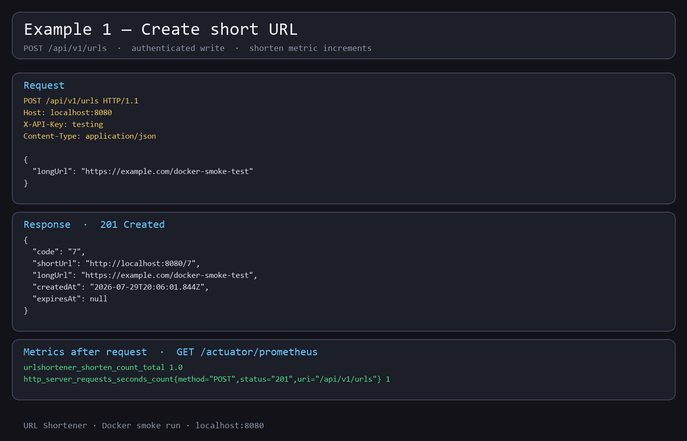
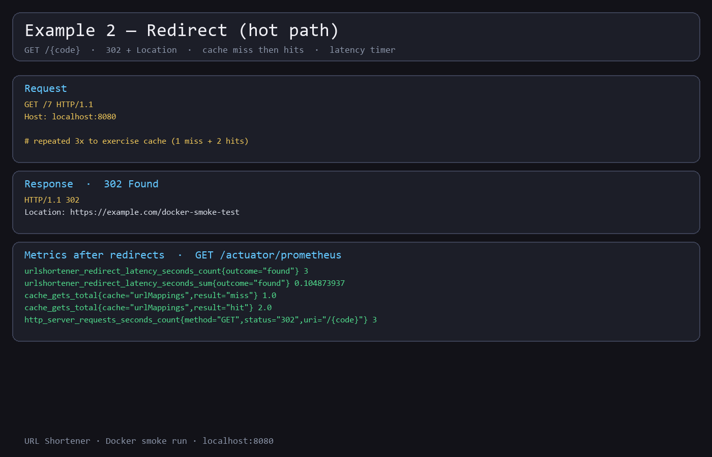
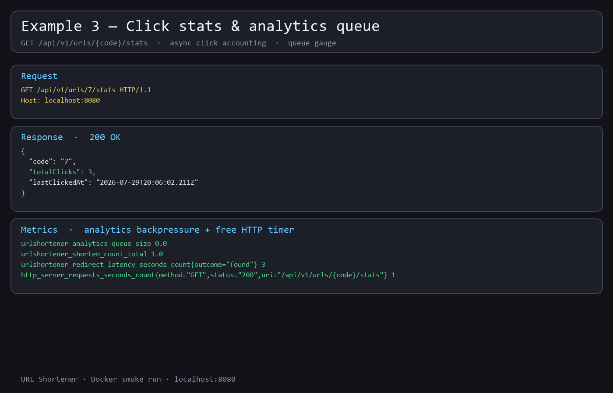

# Demo

These three captures came from a real run of the Docker stack
(`docker compose up --build` in `urlshortener/`). Each one pairs an HTTP request
with what showed up on `/actuator/prometheus` right after. Full design context is
in [APPLICATION_DESIGN.md](APPLICATION_DESIGN.md); how to start the stack is in
the [README](README.md).

---

## Example 1 — create a short URL

`POST /api/v1/urls` with an `X-API-Key`. Body is just the long URL. You get back
a short code, the short URL, and timestamps. The custom shorten counter ticks up
by one.

---

## Example 2 — redirect

`GET /{code}` returns `302` with `Location` set to the original URL. Hitting the
same code a few times exercises the cache: first lookup is a miss, the next ones
are hits. Redirect latency and the free HTTP request counters update as well.

---

## Example 3 — click stats

`GET /api/v1/urls/{code}/stats` returns how many times the short link was
clicked and when it was last hit. Clicks are recorded asynchronously after the
redirect, so the queue-size gauge is usually `0` once the work has drained.
That's the backpressure signal if analytics ever starts falling behind.

