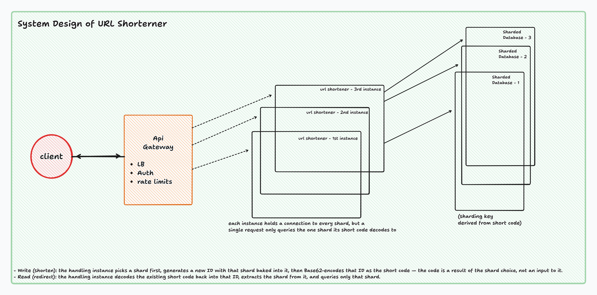

# URL Shortener

A URL shortener built for the AI-Proficient Software Engineer take-home. Shorten a
URL, get redirected when you hit the short link, see basic click stats.

Full reasoning behind the design choices is in [SYSTEM_DESIGN.md](SYSTEM_DESIGN.md).
The three required scenarios (greenfield / brownfield / ambiguous), testing approach,
and final summary are in [ARCHITECTURE.md](ARCHITECTURE.md).



## Stack

Java 21, Spring Boot, Postgres, Maven.

## Running it

```
cd urlshortener
docker compose up -d
./mvnw spring-boot:run
```

App comes up on `localhost:8080`. Health check at `/actuator/health`, API docs at
`/swagger-ui.html`.

## API

| Method | Path | What it does |
|---|---|---|
| POST | `/api/v1/urls` | Shorten a URL |
| GET | `/{code}` | Redirect to the original URL |
| GET | `/api/v1/urls/{code}` | Look up the metadata for a code |
| GET | `/api/v1/urls/{code}/stats` | Click count for a code |
| DELETE | `/api/v1/urls/{code}` | Disable a short link |

`POST` and `DELETE` need an `X-API-Key` header. `GET` doesn't.

## Tests

```
./mvnw test
```

Runs against an embedded H2 database, so nothing extra needs to be running.
