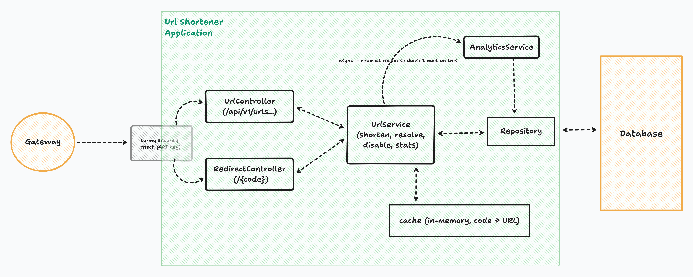

# URL Shortener

A URL shortener built for the AI-Proficient Software Engineer take-home. Shorten a
URL, get redirected when you hit the short link, see basic click stats.

| Doc | What it's for |
|---|---|
| [SYSTEM_DESIGN.md](SYSTEM_DESIGN.md) | How this would scale (gateway, instances, sharding) — not fully built |
| [APPLICATION_DESIGN.md](APPLICATION_DESIGN.md) | What's actually built (controllers, services, cache, db) |
| [ARCHITECTURE.md](ARCHITECTURE.md) | Scenarios, testing approach, observability, summary |
| [DEMO.md](DEMO.md) | Request + metrics captures from a Docker smoke run |




## Stack

- **Java 21**, **Spring Boot**, **Maven**
- **Postgres 16** (source of truth; H2 only in tests)
- **Caffeine** in-process cache on the redirect path
- **Flyway** for schema migrations
- **Spring Security** — `X-API-Key` on write endpoints
- **Actuator + Prometheus** metrics
- **springdoc** OpenAPI / Swagger UI
- **Docker Compose** for app + database

## Prerequisites

- Docker Desktop (for the full stack), **or** Java 21 + Docker only for Postgres
- Maven wrapper is in the repo (`./mvnw` / `mvnw.cmd`) — no global Maven install needed

## Running it

### Option A — full stack (app + Postgres) via Docker

```
cd urlshortener
docker compose up --build -d
```

That builds the app image, starts Postgres, waits until Postgres is healthy, then
starts the app. The app reaches the DB over the compose network
(`jdbc:postgresql://postgres:5432/urlshortener`).

App listens on **http://localhost:8080**.

Stop (keeps the Postgres volume so data survives restarts):

```
docker compose down
```

Wipe the database volume too:

```
docker compose down -v
```

### Option B — local app, Postgres in Docker

```
cd urlshortener
docker compose up -d postgres
./mvnw spring-boot:run
```

On Windows: `mvnw.cmd spring-boot:run`.

Defaults in `application.properties` already point at `localhost:5432` with the
same credentials compose uses (`urlshortener` / `urlshortener`), so no extra
config is needed for a normal local run.

### Useful URLs once it's up

| What | URL |
|---|---|
| Swagger UI (try the API in a browser) | http://localhost:8080/swagger-ui.html |
| OpenAPI JSON | http://localhost:8080/v3/api-docs |
| Health | http://localhost:8080/actuator/health |
| Prometheus metrics | http://localhost:8080/actuator/prometheus |

## Swagger UI

1. Start the app (Docker or `./mvnw spring-boot:run`).
2. Open **http://localhost:8080/swagger-ui.html** in a browser.
3. Click **Authorize**, enter the API key (default is `testing`), and confirm.
4. Expand an endpoint → **Try it out** → fill the body if needed → **Execute**.

`POST` and `DELETE` need the key (Swagger sends it as the `X-API-Key` header).
`GET` routes, including redirect and stats, work without authorizing.

Override the key when running Docker:

```
# PowerShell
$env:API_KEY="your-key"; docker compose up --build -d

# bash
API_KEY=your-key docker compose up --build -d
```

For a local Maven run, set `API_KEY` in the environment or change
`app.api-key` / the default in `application.properties`.

## API

| Method | Path | Auth | What it does |
|---|---|---|---|
| POST | `/api/v1/urls` | `X-API-Key` | Shorten a URL |
| GET | `/{code}` | none | Redirect to the original URL |
| GET | `/api/v1/urls/{code}` | none | Look up metadata for a code |
| GET | `/api/v1/urls/{code}/stats` | none | Click count for a code |
| DELETE | `/api/v1/urls/{code}` | `X-API-Key` | Disable a short link |

### Quick curl examples

Create (default key is `testing`):

```
curl -s -X POST http://localhost:8080/api/v1/urls ^
  -H "Content-Type: application/json" ^
  -H "X-API-Key: testing" ^
  -d "{\"longUrl\": \"https://example.com/hello\"}"
```

On bash, use `\` line continuations and single-quoted JSON instead of the `^` form.

Redirect (prints the `Location` header; does not follow it):

```
curl -s -D - -o NUL http://localhost:8080/{code}
```

Stats:

```
curl -s http://localhost:8080/api/v1/urls/{code}/stats
```

Replace `{code}` with the value returned from create.

## Tests

```
cd urlshortener
./mvnw test
```

Runs unit and integration tests against an embedded H2 database — nothing else
needs to be running. Coverage includes create/redirect/delete round-trips, URL
safety, cache behavior, concurrent click accounting, and API-key rejection.

## Project layout

```
.
├── README.md
├── SYSTEM_DESIGN.md          # scale-out design
├── APPLICATION_DESIGN.md     # in-process design
├── ARCHITECTURE.md           # scenarios, testing, observability
├── DEMO.md                   # live request + metrics examples
├── images/                   # system + application diagrams
├── examples/                 # example-1/2/3 capture images
└── urlshortener/             # Spring Boot app
    ├── Dockerfile
    ├── docker-compose.yml    # app + Postgres
    ├── pom.xml
    └── src/
```

## Configuration (common knobs)

| Env / property | Default | Notes |
|---|---|---|
| `API_KEY` / `app.api-key` | `testing` | Required on POST/DELETE via `X-API-Key` |
| `DB_URL` | `jdbc:postgresql://localhost:5432/urlshortener` | In compose: host is `postgres` |
| `DB_USERNAME` / `DB_PASSWORD` | `urlshortener` | Matches compose Postgres |
| `server.port` | `8080` | HTTP port |

See `urlshortener/.env.example` for a copy-paste template (`.env` itself is
gitignored).

## What you get / what you don't

**In scope:** shorten, redirect, metadata, click stats, API key on writes, cache
on redirect, async click recording, Flyway schema, Dockerized app+DB, metrics and
structured logs with a correlation id, automated tests, design docs.

**Out of scope (deliberate):** multi-instance deploy, gateway/rate limiting in
code, Redis/shared cache, Prometheus/Grafana containers, SSO, admin UI. The
scale story is documented in [SYSTEM_DESIGN.md](SYSTEM_DESIGN.md) rather than
built into the prototype.
